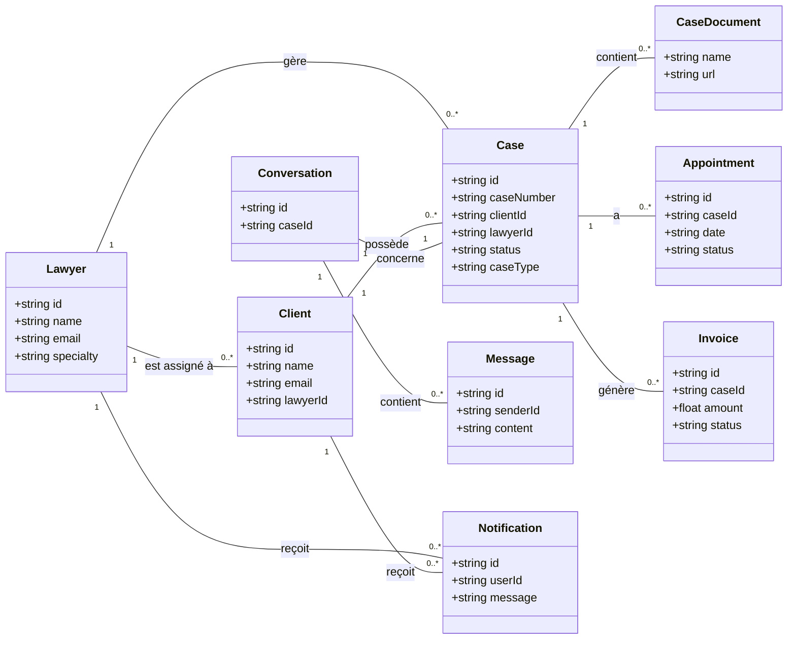

# Rapport de Projet : AvocatConnect

Ce document détaille l'architecture, les objectifs et les technologies de l'application AvocatConnect.

## 1. Objectif de l'Application

**AvocatConnect** est une plateforme digitale conçue pour moderniser et simplifier l'interaction entre les avocats et leurs clients. L'objectif principal est de centraliser la gestion des affaires juridiques, d'améliorer la communication et d'offrir des outils intelligents pour optimiser le travail des professionnels du droit et l'expérience des clients.

## 2. Contenu et Fonctionnalités Clés

L'application est divisée en deux portails distincts avec des fonctionnalités spécifiques :

### Portail Avocat
- **Tableau de bord :** Vue d'ensemble de l'activité (affaires en cours, nouvelles affaires, rendez-vous à venir, tâches rapides).
- **Gestion des affaires :** Création, consultation, et mise à jour du statut des affaires.
- **Gestion des documents :** Ajout de documents aux affaires et génération de résumés par IA.
- **Messagerie :** Communication sécurisée et centralisée avec chaque client.
- **Calendrier :** Visualisation et gestion des rendez-vous.
- **Gestion financière :** Création de factures pour les affaires.

### Portail Client
- **Sélection de l'avocat :** Un nouveau client peut choisir son avocat parmi une liste de professionnels inscrits.
- **Tableau de bord :** Vue synthétique des affaires en cours, des messages non lus, des factures en attente et du prochain rendez-vous.
- **Soumission d'affaires :** Les clients peuvent soumettre une nouvelle affaire avec une description et obtenir une estimation de coût initiale générée par l'IA.
- **Gestion des documents :** Ajout de pièces et de documents pertinents à leurs affaires.
- **Messagerie :** Échanges directs avec l'avocat assigné.
- **Prise de rendez-vous :** Demande de rendez-vous avec l'avocat.
- **Paiements :** Consultation et paiement des factures.

### Fonctionnalités d'Intelligence Artificielle
- **Résumé de documents :** L'IA peut analyser un document (image ou PDF) et en générer un résumé concis.
- **Estimation de coût :** Lors de la soumission d'une affaire, l'IA fournit une première estimation du coût potentiel.
- **Chatbot :** Un assistant IA est disponible pour répondre aux questions générales des utilisateurs.

## 3. Technologies Utilisées

La plateforme est construite sur une pile technologique moderne et robuste :

- **Framework Frontend :** **Next.js 15** (avec React 18) utilisant l'App Router pour une performance et une organisation optimales.
- **Langage :** **TypeScript** pour la robustesse et la sécurité des types.
- **Base de Données & Authentification :** **Firebase** (Firestore comme base de données NoSQL et Firebase Authentication pour la gestion des utilisateurs).
- **Intelligence Artificielle :** **Google Genkit** avec les modèles **Gemini** pour toutes les fonctionnalités génératives.
- **Styling :** **Tailwind CSS** pour le design et **ShadCN UI** pour la bibliothèque de composants d'interface utilisateur.
- **Déploiement Mobile (potentiel) :** **Capacitor**, permettant de transformer l'application web en une application mobile native pour Android et iOS.

## 4. Méthodologie de Développement

La méthodologie utilisée n'est pas un framework rigide comme Scrum, mais plutôt une approche **Agile et Conversationnelle**.

- **Développement Itératif :** L'application est construite de manière incrémentale. Chaque demande que vous formulez est une "itération" qui ajoute ou modifie une fonctionnalité.
- **Prototypage Rapide :** Je génère rapidement des fonctionnalités fonctionnelles que vous pouvez tester et valider immédiatement.
- **Boucle de Rétroaction Continue :** Le processus est centré sur vos retours. Vous êtes l'équivalent du "Product Owner" : vous définissez les besoins, et j'exécute le développement.
- **Flexibilité :** Cette approche permet une grande souplesse pour s'adapter aux changements et aux nouvelles idées en cours de projet.

On peut décrire ce cycle comme suit : **Demande -> Analyse -> Planification -> Génération de code -> Validation et Nouvelle Demande**.

## 5. Diagramme de Classe

Voici un diagramme de classe illustrant les principales entités de données de l'application et leurs relations.

